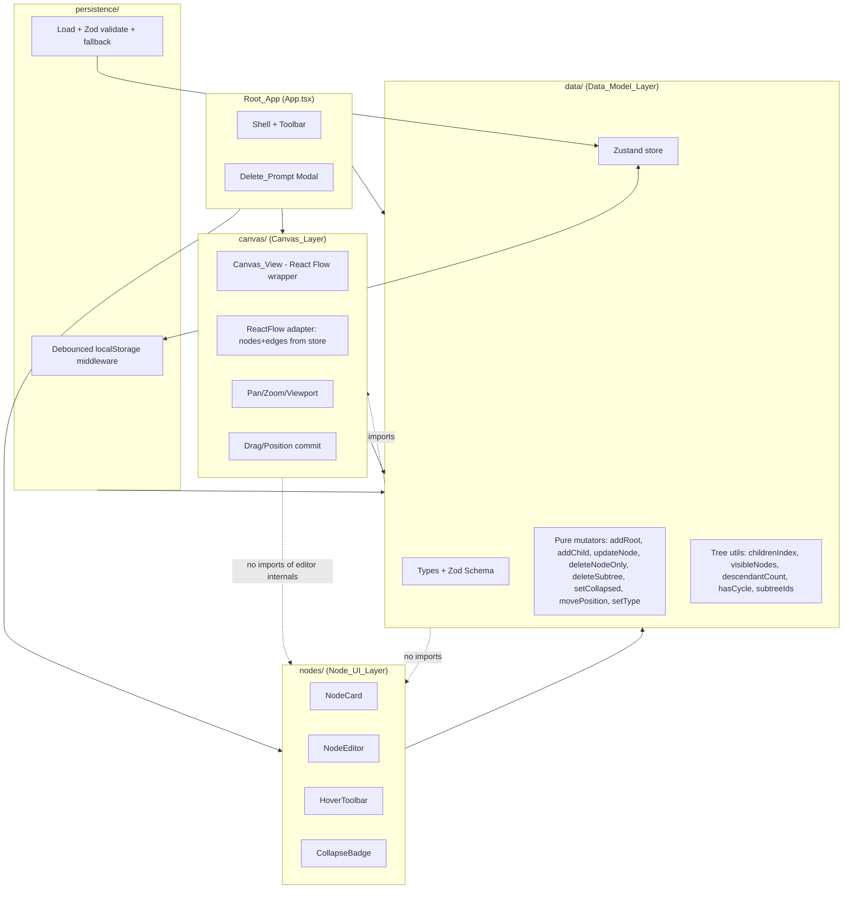
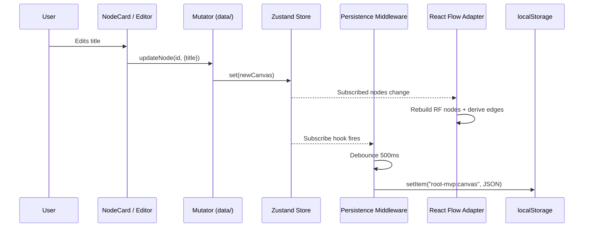
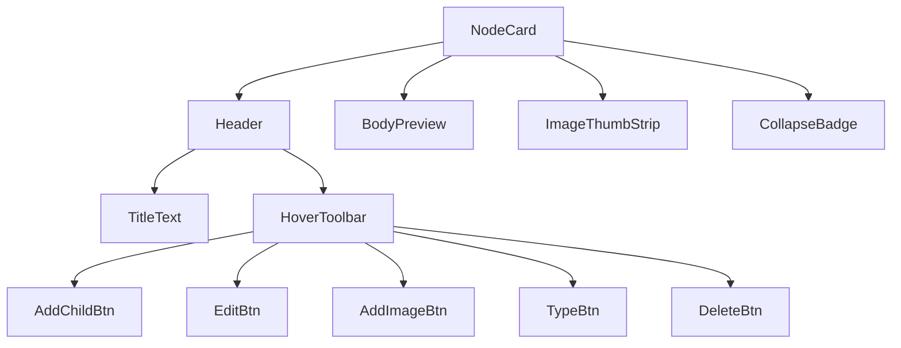
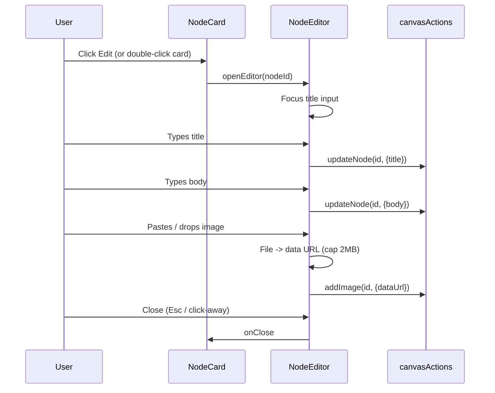
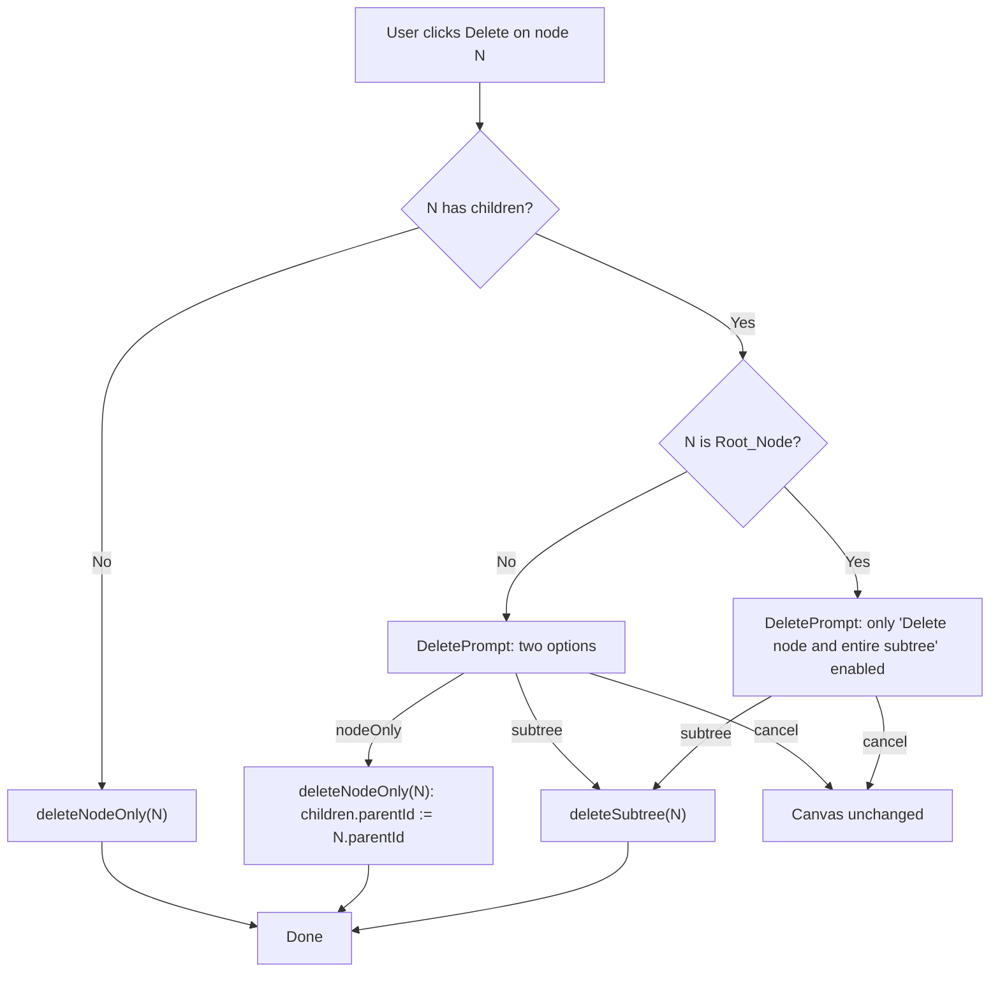
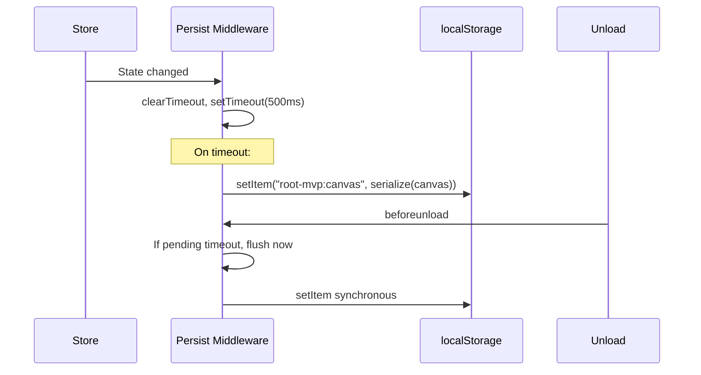

# Design Document: Root MVP

## Overview

Root MVP is a client-only, desktop-first, canvas-based research tool for manually constructing a hierarchical tree of research nodes on an infinite pannable and zoomable canvas. The MVP has no backend, no AI generation, and no collaboration. State lives in the browser, is persisted to `localStorage`, and is restored exactly on reload.

The design is organized around a strict separation between three isolated modules:

- **Data Model Layer** (`data/`) — pure TypeScript. Owns the `Canvas` and `Node` types, their Zod schemas, all mutations, tree utilities, and visibility computation. Has zero imports from `canvas/` or `nodes/`. This is the surface a future AI-generation step will plug into.
- **Canvas Layer** (`canvas/`) — a React Flow wrapper that renders the infinite surface, handles pan / zoom / drag, and derives edges (Connectors) from `parentId` on each render. Depends on the Data Model Layer for state; does not import from `nodes/` internals.
- **Node UI Layer** (`nodes/`) — presentational components: `NodeCard`, `NodeEditor`, `DeletePrompt`, hover toolbar. Depends on the Data Model Layer; does not import from `canvas/` internals.

The stack is React 18 + TypeScript + Vite, styled with Tailwind CSS configured from the DESIGN.md tokens (ABC Diatype Plus Variable font, palette `color.text.*` / `color.surface.*` including `#ff3c00` strong accent, radii 6px/8px, 100–400ms motion scale, flat material). State is held in a Zustand store fronted by the Data Model Layer's typed mutators, and a Zustand middleware debounces persistence writes to `localStorage`.

The design satisfies the requirements as follows: pan / zoom / connectors via React Flow (R1), root and child creation flows through pure mutators that emit properly-shaped nodes (R2, R3), inline `NodeEditor` for title / body / images / type (R4), drag commits final position on release (R5), collapse hides transitive descendants using a computed visibility set (R6), delete prompts with reparent-or-subtree semantics (R7), debounced `localStorage` persistence with Zod-validated load and `beforeunload` flush (R8), a stable JSON shape defined by a single Zod schema (R9), module isolation enforced by folder boundaries and eslint rules (R10), Tailwind tokens sourced from DESIGN.md (R11), viewport culling and memoized selectors (R12), MVP scope kept tight (R13), and an end-to-end walkthrough covered by an integration test (R14).

### Key Decisions and Rationale

- **React Flow for the Canvas Layer.** Building infinite pan / zoom / connector rendering / drag from scratch on top of `<canvas>` or SVG is weeks of work with subtle performance and interaction bugs. React Flow gives us all of it, has built-in viewport culling, and lets us treat it as a rendering adapter — our data still lives in the Zustand store, and edges are derived every render from `parentId`. This is the fastest path to an MVP that meets the 16 ms frame time target at 100–150 visible nodes (R1.7, R12.1).
- **Edges are derived, not stored.** R9.3 mandates parent-id-only structure. React Flow accepts an `edges` prop each render, so we compute it from the visible node set. No source of truth is duplicated.
- **Zustand + typed mutators.** Redux is overkill; raw `useState` is under-powered for the cross-cutting concerns (persistence middleware, selectors, viewport). Zustand gives us a small store with subscribe-based selectors that React Flow and node UI can consume without prop-drilling. The store never exposes `set` to feature code — all writes go through mutators defined in the Data Model Layer.
- **Zod for the persistence boundary.** The Canvas JSON is the contract between manual edits today and AI generation tomorrow (R9, R10.5). A single Zod schema is both runtime validator and TypeScript source of truth via `z.infer`.
- **Data URLs for images, size-capped.** No object storage in MVP. Images are inlined as data URLs with a per-image cap (2 MB) and a per-canvas soft cap that surfaces a warning. This keeps persistence self-contained.
- **Flat material and ABC Diatype Plus Variable body font.** DESIGN.md is strict: no shadows, no backdrop-filter, no decorative gradients beyond the one enumerated, and ABC Diatype Plus Variable as the primary family. Selection and focus states use 1–2 px palette-color borders, not elevation.

## Architecture

### High-Level Module Diagram



### Data Flow (Single Mutation)



### Module Boundaries and Import Rules

| Module | May import from | May NOT import from |
|--------|-----------------|---------------------|
| `data/` | `zod`, standard library | `canvas/`, `nodes/`, `react`, `reactflow` |
| `canvas/` | `data/`, `reactflow`, `react` | `nodes/*` internals (only the exported `NodeCard` component via a registered React Flow node type) |
| `nodes/` | `data/`, `react` | `canvas/`, `reactflow` |
| `persistence/` | `data/`, `zod` | `canvas/`, `nodes/`, `react` |
| `app/` (shell) | all of the above | — |

Enforced with an ESLint rule (`eslint-plugin-boundaries` or `no-restricted-imports`) so R10.1 / R10.2 / R10.3 do not regress.

### Directory Layout

```
src/
  data/
    types.ts             // TS types + Zod schemas + z.infer aliases
    schema.ts            // canvasSchema, nodeSchema
    mutators.ts          // pure mutators over Canvas
    tree.ts              // childrenIndex, visibleNodes, descendantCount, hasCycle, subtreeIds
    store.ts             // Zustand store + selectors + exposed actions
    ids.ts               // id generator (crypto.randomUUID)
    time.ts              // now() = new Date().toISOString()
    index.ts             // barrel: only the public surface
  canvas/
    CanvasView.tsx       // React Flow provider + culling config
    useReactFlowGraph.ts // derives RF nodes+edges from store's visible set
    edgeStyles.ts
    index.ts
  nodes/
    NodeCard.tsx
    NodeEditor.tsx
    HoverToolbar.tsx
    CollapseBadge.tsx
    ImageThumbStrip.tsx
    DeletePrompt.tsx
    typeStyles.ts        // Node_Type -> palette pairing
    index.ts
  persistence/
    middleware.ts        // Zustand middleware, 500ms debounce, beforeunload flush
    load.ts              // load + Zod validate + fallback preservation
    keys.ts              // "root-mvp:canvas", "root-mvp:canvas.raw"
  app/
    App.tsx
    Toolbar.tsx
    index.css            // Tailwind entry
  main.tsx
  tailwind.config.ts
```

## Components and Interfaces

### Data Model Layer — Public Surface (`data/index.ts`)

```ts
// Types
export type UUID = string;
export type NodeType = 'topic' | 'finding' | 'question' | 'conclusion';
export interface ImageEntry { id: UUID; dataUrl: string; addedAt: string; }
export interface Position { x: number; y: number; }
export interface Node { /* see Data Models */ }
export interface Canvas { /* see Data Models */ }

// Schemas
export { canvasSchema, nodeSchema } from './schema';

// Mutators (pure — take a Canvas, return a new Canvas or an Error)
export function addRoot(c: Canvas, opts: { position: Position }): Canvas;
export function addChild(c: Canvas, parentId: UUID, opts: { position: Position }): Canvas;
export function updateNode(c: Canvas, id: UUID, patch: Partial<Pick<Node,
  'title' | 'body' | 'type'>>): Canvas;
export function addImage(c: Canvas, id: UUID, image: ImageEntry): Canvas;
export function removeImage(c: Canvas, id: UUID, imageId: UUID): Canvas;
export function moveNode(c: Canvas, id: UUID, position: Position): Canvas;
export function setCollapsed(c: Canvas, id: UUID, collapsed: boolean): Canvas;
export function deleteNodeOnly(c: Canvas, id: UUID): Canvas; // reparents children
export function deleteSubtree(c: Canvas, id: UUID): Canvas;

// Tree utilities
export function childrenIndex(c: Canvas): Map<UUID | null, Node[]>;
export function visibleNodeIds(c: Canvas): Set<UUID>;
export function descendantCount(c: Canvas, id: UUID): number;
export function subtreeIds(c: Canvas, id: UUID): Set<UUID>; // inclusive
export function hasCycle(c: Canvas, childId: UUID, newParentId: UUID | null): boolean;
export function rootNode(c: Canvas): Node | undefined;

// Serialization
export function serializeCanvas(c: Canvas): string;
export function parseCanvas(raw: string): { ok: true; canvas: Canvas }
  | { ok: false; error: string; raw: string };

// Store (React binding)
export const useCanvasStore: UseBoundStore<StoreApi<CanvasState>>;
export const canvasActions: {
  addRoot(p: Position): void;
  addChild(parentId: UUID, p: Position): void;
  updateNode(id: UUID, patch: Partial<Node>): void;
  addImage(id: UUID, image: ImageEntry): void;
  removeImage(id: UUID, imageId: UUID): void;
  moveNode(id: UUID, p: Position): void;
  setCollapsed(id: UUID, c: boolean): void;
  deleteNodeOnly(id: UUID): void;
  deleteSubtree(id: UUID): void;
};
```

Mutators are pure functions over `Canvas`. The Zustand actions are the only place `set` is called — they invoke the mutator and stamp `canvas.updatedAt = now()`.

### Canvas Layer — Public Surface (`canvas/index.ts`)

```ts
export function CanvasView(props: { onNodeSelect?: (id: UUID) => void }): JSX.Element;
```

Internally, `CanvasView`:
- Wraps `<ReactFlowProvider>` and renders `<ReactFlow>`.
- Registers a single custom node type `'research'` that renders the exported `NodeCard` from `nodes/`.
- Subscribes to `useCanvasStore` via `useReactFlowGraph()`, which returns `{ nodes: RFNode[], edges: RFEdge[] }` derived from the visible-node set and `childrenIndex`. Edges use `type: 'default'` (bezier) with a 1 px stroke in `#312e2e` (color.text.tertiary).
- Uses `nodesDraggable` on, `nodesConnectable` off, `elementsSelectable` on, `minZoom={0.25}`, `maxZoom={2.5}` (R1.4).
- Wires `onNodeDragStop` to commit the final position via `canvasActions.moveNode` (R5.2). Interim drag positions live inside React Flow's internal state only — we never write to the store per-frame.
- Uses React Flow's `onlyRenderVisibleElements` to cull off-screen nodes (R12.2).

### Node UI Layer — Public Surface (`nodes/index.ts`)

```ts
export function NodeCard(props: NodeProps<{ nodeId: UUID }>): JSX.Element;
export function NodeEditor(props: { nodeId: UUID; onClose(): void }): JSX.Element;
export function DeletePrompt(props: {
  nodeId: UUID;
  onCancel(): void;
  onConfirm(mode: 'nodeOnly' | 'subtree'): void;
}): JSX.Element;
```

Component tree inside a `NodeCard`:



- `NodeCard` reads `useCanvasStore(state => state.canvas.nodes.find(n => n.id === nodeId))` via a memoized selector. The card style variant is picked by `typeStyles[node.type]`.
- `HoverToolbar` renders inside the card and only becomes opaque on `:hover`/`:focus-within`. Buttons dispatch to `canvasActions`.
- `CollapseBadge` renders only when `node.collapsed === true` and shows `descendantCount(canvas, id)` (R6.5).
- Selection style: `border: 2px solid #ff3c00` (color.surface.strong). No shadows. (R11.7)

### Editor Flow



Editor UI:
- Title: single-line `<input>`, capped at 200 chars.
- Body: `<textarea>`, plain text, auto-growing, capped at 20 000 chars.
- Type selector: 4 buttons for `topic | finding | question | conclusion`, styled with each type's palette pairing (see `typeStyles`).
- Images: drop zone + paste handler + file picker. Files are read with `FileReader.readAsDataURL`, rejected if > 2 MB, appended via `addImage`.

### Delete Flow



R7.5: when N is the root and has children, the "nodeOnly" option is disabled — reparenting to `null` would leave multiple roots and violate R9 / R14 invariants.

### Persistence



Load path (on `App` mount, before rendering `CanvasView`):

```ts
function loadInitialCanvas(): Canvas {
  const raw = localStorage.getItem('root-mvp:canvas');
  if (raw == null) return emptyCanvas();
  const result = parseCanvas(raw);
  if (result.ok) return result.canvas;
  // R8.5: preserve raw payload, surface recoverable error
  localStorage.setItem('root-mvp:canvas.raw', raw);
  toast.error('Saved canvas could not be loaded. Your data was preserved for recovery.');
  return emptyCanvas();
}
```

## Data Models

The data model is the contract for R9 and the future AI generation plug-in surface (R10.5). It uses `parentId`-only tree structure and no separate edges array.

### TypeScript + Zod

```ts
// data/schema.ts
import { z } from 'zod';

export const nodeTypeSchema = z.enum(['topic', 'finding', 'question', 'conclusion']);

export const positionSchema = z.object({
  x: z.number().finite(),
  y: z.number().finite(),
});

export const imageEntrySchema = z.object({
  id: z.string().uuid(),
  dataUrl: z.string().startsWith('data:'),
  addedAt: z.string().datetime(),
});

export const nodeSchema = z.object({
  id: z.string().uuid(),
  parentId: z.string().uuid().nullable(),
  title: z.string().max(200),
  body: z.string().max(20_000),
  images: z.array(imageEntrySchema),
  type: nodeTypeSchema,
  position: positionSchema,
  collapsed: z.boolean(),
  createdAt: z.string().datetime(),
  updatedAt: z.string().datetime(),
});

export const canvasSchema = z.object({
  id: z.string().uuid(),
  title: z.string().max(200),
  nodes: z.array(nodeSchema),
  updatedAt: z.string().datetime(),
}).superRefine((canvas, ctx) => {
  const ids = new Set<string>();
  let rootCount = 0;
  for (const n of canvas.nodes) {
    if (ids.has(n.id)) ctx.addIssue({ code: 'custom', message: `duplicate node id ${n.id}` });
    ids.add(n.id);
    if (n.parentId === null) rootCount += 1;
  }
  for (const n of canvas.nodes) {
    if (n.parentId !== null && !ids.has(n.parentId)) {
      ctx.addIssue({ code: 'custom', message: `dangling parentId ${n.parentId}` });
    }
  }
  if (canvas.nodes.length > 0 && rootCount !== 1) {
    ctx.addIssue({ code: 'custom', message: `expected exactly 1 root, got ${rootCount}` });
  }
  // cycle detection via iterative parent walk with visited set
  for (const n of canvas.nodes) {
    let cur: string | null = n.parentId;
    const seen = new Set<string>([n.id]);
    while (cur !== null) {
      if (seen.has(cur)) {
        ctx.addIssue({ code: 'custom', message: `cycle involving node ${n.id}` });
        break;
      }
      seen.add(cur);
      cur = canvas.nodes.find(x => x.id === cur)?.parentId ?? null;
    }
  }
});

export type NodeType = z.infer<typeof nodeTypeSchema>;
export type ImageEntry = z.infer<typeof imageEntrySchema>;
export type Node = z.infer<typeof nodeSchema>;
export type Canvas = z.infer<typeof canvasSchema>;
```

### Node_Type Palette Mapping (`nodes/typeStyles.ts`)

Each `Node_Type` gets a distinct pairing drawn only from the DESIGN.md §Style Foundations palette. No new colors introduced.

| Node_Type | Border | Title text | Background |
|-----------|--------|-----------|------------|
| `topic` | `#ff3c00` (color.surface.strong) | `#191818` (color.text.primary) | `#ffffff` (color.surface.raised) |
| `finding` | `#312e2e` (color.text.tertiary) | `#191818` (color.text.primary) | `#f6f5f4` (color.surface.muted) |
| `question` | `#18191b` (color.text.secondary) | `#312e2e` (color.text.tertiary) | `#ffffff` (color.surface.raised) |
| `conclusion` | `#ff3c00` (color.surface.strong) | `#ffffff` (color.surface.raised) | `#ff3c00` (color.surface.strong) |

Borders are 1 px (or 2 px when selected). All cards use `border-radius: 8px` (DESIGN.md `radius.sm`).

### Store Shape (`data/store.ts`)

```ts
interface CanvasState {
  canvas: Canvas;
  selection: { nodeId: UUID | null };
  editor: { openNodeId: UUID | null };
  deletePrompt: { nodeId: UUID | null };
  viewport: { x: number; y: number; zoom: number }; // mirrored from React Flow
}
```

The store exposes named actions on a separate `canvasActions` object so components import a stable typed API instead of hand-rolling `set` calls (this enforces R10.4 — mutations happen only through the documented interface).

### Tree Utilities (`data/tree.ts`)

```ts
// O(n) — build once per store read where needed, memoized by canvas identity
export function childrenIndex(c: Canvas): Map<UUID | null, Node[]>;

// A node is visible iff it exists AND every ancestor has collapsed === false.
// (The node's own `collapsed` hides its children, not itself — R6.2.)
export function visibleNodeIds(c: Canvas): Set<UUID>;

// Count of transitive descendants (excludes the node itself). Used by CollapseBadge.
export function descendantCount(c: Canvas, id: UUID): number;

// Inclusive: {id} ∪ transitive descendants.
export function subtreeIds(c: Canvas, id: UUID): Set<UUID>;

// True if setting childId.parentId := newParentId would create a cycle,
// i.e. newParentId is in subtreeIds(childId). Also true if childId === newParentId.
export function hasCycle(c: Canvas, childId: UUID, newParentId: UUID | null): boolean;

// The single node with parentId === null, or undefined if the canvas is empty.
export function rootNode(c: Canvas): Node | undefined;
```

Complexity: `childrenIndex` is O(n) and memoized by the store's canvas reference; `visibleNodeIds` is one DFS from the root, O(n). At 150 nodes these are sub-millisecond and safe to recompute per interaction frame.

### Mutator Semantics (Precise)

- `addRoot(c, {position})`: precondition `c.nodes.length === 0`. Appends a node with `parentId: null`, `type: 'topic'`, empty title / body / images, `collapsed: false`, timestamps set to `now()`. If preconditions fail, returns `c` unchanged and logs.
- `addChild(c, parentId, {position})`: appends `{parentId, type:'topic', title:'', body:'', images:[], collapsed:false, ...}`. If the parent is currently collapsed, sets `parent.collapsed = false` first (R3.4). Rejects if `parentId` is not in `c` (R3.5 — cycle rejection is trivially covered because new node has no children).
- `updateNode(c, id, patch)`: shallow-merges allowed fields (`title`, `body`, `type`), bumps `updatedAt`.
- `addImage` / `removeImage`: list mutations on `images`, bump `updatedAt`. `addImage` rejects data URLs exceeding 2 MB (checked by length before store commit).
- `moveNode(c, id, position)`: sets position, bumps `updatedAt`. Does not touch descendants (R5.4).
- `setCollapsed(c, id, collapsed)`: sets `collapsed`, bumps `updatedAt`.
- `deleteNodeOnly(c, id)`: for each child `k` with `k.parentId === id`, set `k.parentId := c.nodes.find(n=>n.id===id).parentId`. Then remove the node. Precondition: not the root when children exist (R7.5).
- `deleteSubtree(c, id)`: remove every node in `subtreeIds(c, id)`.

All mutators return a **new** `Canvas` object (immutability), enabling cheap referential-equality checks in Zustand selectors.

## Correctness Properties

*A property is a characteristic or behavior that should hold true across all valid executions of a system — essentially, a formal statement about what the system should do. Properties serve as the bridge between human-readable specifications and machine-verifiable correctness guarantees.*

The Data Model Layer is a pure functional core (parentId-only trees, immutable canvases, serialization to JSON) — a perfect fit for property-based testing. The properties below are derived from the prework analysis and are consolidated to eliminate redundancy: each property provides unique validation value. Non-testable requirements (visual, performance, UI-integration, scope-boundary) are covered separately in the Testing Strategy.

### Property 1: Visibility rule

*For any* `Canvas` `c` and any node id `n` in `c`, `n ∈ visibleNodeIds(c)` if and only if every ancestor of `n` (via `parentId`) has `collapsed === false`. Equivalently, `n` is hidden iff at least one strict ancestor of `n` has `collapsed === true`.

**Validates: Requirements 1.1, 6.2, 6.4**

### Property 2: Edge derivation from parentId

*For any* `Canvas` `c`, the derived edge set produced by the React Flow adapter equals exactly `{ (p, k) | p, k ∈ visibleNodeIds(c) ∧ k.parentId === p.id }`. No stored edges exist; the derived set contains no duplicates and no edges incident to hidden nodes.

**Validates: Requirements 1.5**

### Property 3: addRoot postcondition

*For any* `Position` `p`, applying `addRoot(emptyCanvas(), { position: p })` produces a `Canvas` with exactly one node whose `parentId === null`, `type === 'topic'`, `title === ''`, `body === ''`, `images === []`, `collapsed === false`, `position === p`, and `createdAt === updatedAt`.

**Validates: Requirements 2.2**

### Property 4: addChild postcondition

*For any* `Canvas` `c` and any node id `parentId` present in `c`, and any `Position` `p`, applying `addChild(c, parentId, { position: p })` produces a `Canvas` `c'` such that: (a) `c'.nodes.length === c.nodes.length + 1`, (b) the new node has `parentId === parentId`, `type === 'topic'`, empty title/body/images, `collapsed === false`, `position === p`, (c) the parent's `collapsed` is `false` in `c'` regardless of its value in `c`, and (d) `c'` satisfies all structural invariants (single root, no cycles, no dangling parentIds).

**Validates: Requirements 3.1, 3.4**

### Property 5: Initial child position non-overlap

*For any* `Canvas` `c` and any parent node `p` in `c`, the position assigned to a newly added child by `addChild` produces a bounding box (at the standard node size) that does not intersect the bounding box of `p` or of any existing direct child of `p`.

**Validates: Requirements 3.2**

### Property 6: updateNode preserves the patch

*For any* `Canvas` `c`, any node id `id` in `c`, and any `patch ⊆ { title, body, type }` with values conforming to the schema, `updateNode(c, id, patch)` produces `c'` such that: (a) the node at `id` has each patched field set to the patch's value, (b) all other fields on that node are unchanged, (c) all other nodes are unchanged, and (d) the node's `updatedAt` is strictly greater than or equal to the input's `updatedAt`.

**Validates: Requirements 4.2, 4.3, 4.6**

### Property 7: Image add/remove round-trip

*For any* `Canvas` `c`, any node id `id` in `c`, and any well-formed `ImageEntry` `img` (with a fresh id), `removeImage(addImage(c, id, img), id, img.id).nodes[id].images` deep-equals `c.nodes[id].images`.

**Validates: Requirements 4.4, 4.5**

### Property 8: typeStyles palette conformance

*For any* `NodeType` `t ∈ { 'topic', 'finding', 'question', 'conclusion' }`, `typeStyles[t]` returns a `{ border, background, text }` pairing whose values are all drawn from the DESIGN.md §Style Foundations palette (`color.text.primary=#191818`, `color.text.secondary=#18191b`, `color.text.tertiary=#312e2e`, `color.text.inverse=#37383c`, `color.surface.base=#000000`, `color.surface.muted=#f6f5f4`, `color.surface.raised=#ffffff`, `color.surface.strong=#ff3c00`), and the four returned pairings are pairwise distinct.

**Validates: Requirements 4.7**

### Property 9: moveNode isolation

*For any* `Canvas` `c`, any node id `id` in `c`, and any `Position` `p`, `moveNode(c, id, p)` produces `c'` such that: (a) the node at `id` has `position === p`, and (b) every other node in `c'` has the same `position` as in `c`.

**Validates: Requirements 5.2, 5.4**

### Property 10: Collapse round-trip

*For any* `Canvas` `c` and any node id `id` in `c`, `setCollapsed(setCollapsed(c, id, true), id, false).nodes` deep-equals `c.nodes` modulo the `updatedAt` fields of the toggled node.

**Validates: Requirements 6.3**

### Property 11: descendantCount correctness

*For any* `Canvas` `c` and any node id `id` in `c`, `descendantCount(c, id) === subtreeIds(c, id).size - 1`, i.e. the count reported by the CollapseBadge equals the number of strict transitive descendants.

**Validates: Requirements 6.5**

### Property 12: deleteNodeOnly semantics

*For any* `Canvas` `c` and any non-root node id `id` in `c`, `deleteNodeOnly(c, id)` produces `c'` such that: (a) `id` is not present in `c'`, (b) every node `k` with `k.parentId === id` in `c` has `k.parentId === (c.nodes[id]).parentId` in `c'`, (c) every other node's `parentId` is unchanged, and (d) `c'` satisfies all structural invariants (exactly one root, no cycles, every non-null `parentId` resolves).

**Validates: Requirements 7.1, 7.3**

### Property 13: deleteSubtree semantics

*For any* `Canvas` `c` and any node id `id` in `c`, `deleteSubtree(c, id)` produces `c'` such that: (a) the set of node ids in `c'` equals `idsOf(c) \ subtreeIds(c, id)`, (b) every remaining node's fields are unchanged, and (c) `c'` satisfies all structural invariants.

**Validates: Requirements 7.4**

### Property 14: hasCycle correctness

*For any* `Canvas` `c`, any node id `childId` in `c`, and any candidate `newParentId ∈ (nodeIds(c) ∪ { null })`, `hasCycle(c, childId, newParentId) === true` if and only if `newParentId === childId` or `newParentId ∈ subtreeIds(c, childId)`.

**Validates: Requirements 3.5**

### Property 15: Structural invariants under all mutator sequences

*For any* finite sequence of mutator operations `[op_1, op_2, ..., op_k]` applied to the empty canvas — where each `op_i` is one of `addRoot`, `addChild`, `updateNode`, `addImage`, `removeImage`, `moveNode`, `setCollapsed`, `deleteNodeOnly`, `deleteSubtree` with arguments chosen from the current canvas — the resulting canvas `c` satisfies `canvasSchema.safeParse(c).success === true`, which by the schema's `superRefine` guarantees: unique ids, at most one root (exactly one when non-empty), every non-null `parentId` resolves, and no cycles.

**Validates: Requirements 9.1, 9.2**

### Property 16: Serialization round-trip

*For any* `Canvas` `c` that satisfies `canvasSchema`, `parseCanvas(serializeCanvas(c))` returns `{ ok: true, canvas: c' }` where `c'` deep-equals `c` (semantic equality: same field set, same values, arrays in the same order). This subsumes the persistence-restore claim: any state that can be produced by the app can be reloaded exactly.

**Validates: Requirements 6.6, 8.2, 8.3, 9.4, 9.5, 9.6, 14.3**

## Error Handling

Errors in Root MVP fall into three categories: user-input errors (surfaced inline in the UI), data-integrity errors (surfaced as recoverable toasts, raw payload preserved), and programmer errors (thrown, caught by an ErrorBoundary).

### 1. User-input errors — inline, non-destructive

| Scenario | Handling |
|----------|----------|
| Attempted title longer than 200 chars | Input `maxLength=200`; further characters silently rejected. |
| Attempted body longer than 20 000 chars | Textarea `maxLength=20000`; visible character counter turns `#de5052` in the last 200 chars. |
| Image file larger than 2 MB | Drop / paste / picker handler rejects, shows an inline message on the editor: "Images must be under 2 MB." Canvas unchanged. |
| Non-image file dropped on the image drop zone | Silently ignored; drop zone flashes its border once. |
| Attempted `addChild` with an unknown `parentId` | Mutator returns the input canvas unchanged and logs a warning. UI cannot reach this state under normal flow, so no user-facing message. |
| Attempted `deleteNodeOnly` on the root when it has children | The DeletePrompt disables the option (R7.5), so this cannot be dispatched. If reached programmatically, mutator returns input unchanged and logs. |
| Cycle-creating operation (future — reparenting) | `hasCycle` gate at the store action level; rejected operation returns input unchanged, surfaces a toast: "That move would create a cycle." |

### 2. Data-integrity errors — recoverable, raw payload preserved

| Scenario | Handling |
|----------|----------|
| `localStorage` payload malformed (not JSON) | `parseCanvas` returns `{ ok: false, error, raw }`. App writes raw payload to `root-mvp:canvas.raw`, initializes an empty canvas, surfaces a toast: "Saved canvas could not be loaded. Your data was preserved for recovery." (R8.5) |
| `localStorage` payload valid JSON but fails `canvasSchema` | Same as above — `parseCanvas` aggregates Zod errors into a single message. |
| `localStorage.setItem` throws (quota exceeded, private mode) | Middleware catches, surfaces a toast: "Could not save changes to local storage." Continues to attempt on subsequent writes; unsaved state remains in memory. |
| `localStorage.getItem` throws | Treated as "no saved canvas"; empty canvas initialized. |
| `beforeunload` flush write fails | Best-effort; error is logged. There is no UI to surface it at unload time. |

### 3. Programmer errors — surfaced by ErrorBoundary

The App shell wraps `CanvasView` and the modal layer in a top-level React ErrorBoundary that catches render / effect exceptions, displays a static recovery screen ("Something went wrong. Your work has been saved."), and offers a "Reload" button. The ErrorBoundary does not attempt to reset store state — a fresh reload triggers the normal load path against the persisted canvas.

### 4. Invariant violation guardrails

The pure mutators are the last line of defense before the store `set` call:

- Every mutator that adds or reparents a node runs `hasCycle` and `unique-id` checks; on failure it returns the input canvas.
- Every write to the store additionally passes `canvasSchema.safeParse`; on failure the write is aborted, an error is logged, and a toast is surfaced. This ensures the store never holds an invalid canvas, even if a future mutator has a bug.

## Testing Strategy

The testing strategy is a dual approach: **property-based tests** for the pure Data Model Layer (universal invariants across a wide input space) and **example-based unit / integration / e2e tests** for UI interactions, timing behavior, configuration, and the end-to-end walkthrough. Both are necessary — properties catch general correctness bugs, examples pin down specific interactions.

### Layer 1: Property-based tests (Data Model Layer)

- **Library:** `fast-check` (idiomatic for TypeScript, integrates with Vitest).
- **Runner:** Vitest, executed with `vitest --run` in CI.
- **Iterations:** every property test runs a **minimum of 100 iterations** (via `fc.assert(..., { numRuns: 100 })`; heavy properties can specify higher). Cost is low because these tests operate on pure in-memory data structures with no I/O.
- **Location:** `src/data/__tests__/*.property.test.ts`.
- **Tagging:** every property test is tagged in a top-of-test comment with `Feature: root-mvp, Property {N}: {property text}` so the test file is a direct back-reference to the design document.
- **Generators:** a shared `arbCanvas` arbitrary in `src/data/__tests__/arbitraries.ts` generates arbitrary well-formed canvases by starting from `emptyCanvas()` and applying a random sequence of mutators — this guarantees generated canvases satisfy structural invariants, and simultaneously exercises Property 15. Individual property tests draw a canvas from `arbCanvas` and then select a random node id from it (or an arbitrary parent/child pair, as needed).

Each of Properties 1–16 in the Correctness Properties section is implemented as a single property-based test. Example tag comment:

```ts
// Feature: root-mvp, Property 16: For any Canvas c that satisfies canvasSchema,
// parseCanvas(serializeCanvas(c)) returns { ok: true, canvas: c' } where c' deep-equals c.
test('serialization round-trip', () => {
  fc.assert(
    fc.property(arbCanvas, (c) => {
      const parsed = parseCanvas(serializeCanvas(c));
      expect(parsed.ok).toBe(true);
      if (parsed.ok) expect(parsed.canvas).toEqual(c);
    }),
    { numRuns: 100 },
  );
});
```

### Layer 2: Example-based unit tests

- **Framework:** Vitest.
- **Scope:** specific behaviors and edge cases the properties do not target directly.
- **Coverage:**
  - `parseCanvas` on malformed JSON → returns `{ ok: false }` with useful error string.
  - `parseCanvas` on JSON with duplicate ids, missing root, cycles, dangling parentIds → each returns `{ ok: false }` (schema `superRefine` cases).
  - `emptyCanvas()` produces a canvas that passes `canvasSchema`.
  - `deleteNodeOnly` on a leaf equals `deleteSubtree` on the same leaf.
  - Image `dataUrl` byte-size guard rejects payloads > 2 MB.

### Layer 3: Component / integration tests

- **Framework:** Vitest + React Testing Library + `@testing-library/user-event`.
- **Persistence timing** (R8.1, R8.6): use `vi.useFakeTimers()`; fire three `updateNode` actions in rapid succession, advance 499 ms → assert `setItem` not called; advance 1 ms → assert exactly one `setItem` call. Separately fire a change, dispatch `beforeunload`, assert immediate `setItem`.
- **Empty-canvas affordance** (R2.1, R2.3): render `<App />` with empty `localStorage`, assert create-root button visible; after `addRoot`, assert it is hidden.
- **Editor focus on create** (R2.4, R3.3): trigger create-root / add-child, assert the title `<input>` has focus.
- **DeletePrompt for parent** (R7.2): trigger delete on a node with children, assert both options rendered.
- **DeletePrompt for root with children** (R7.5): trigger delete on root, assert the nodeOnly option is disabled.
- **DeletePrompt cancel** (R7.6): open prompt, click cancel, assert canvas unchanged (compare store snapshot).
- **Load error surface** (R8.5): seed `localStorage` with `"{"`, mount, assert error toast rendered and `root-mvp:canvas.raw` contains the original string.
- **React Flow config** (R1.4, R12.2): render `CanvasView`, assert on `minZoom`, `maxZoom`, `onlyRenderVisibleElements` props (via a test-only prop probe).
- **Type-style rendering** (R11.3, R11.4): render a `NodeCard` for each of the four types, snapshot the resulting class list; assert the class list only references palette-token classes.

### Layer 4: Module-boundary tests (R10.1–R10.3)

A dedicated test scans `src/` with a simple AST/import walker (using `es-module-lexer` or `@typescript-eslint/parser`) and asserts:

- No file under `src/data/` imports from `src/canvas/` or `src/nodes/`.
- No file under `src/canvas/` imports internal editor modules from `src/nodes/` (only the public `NodeCard` re-export).
- No file under `src/nodes/` imports from `src/canvas/`.

The same rules are also enforced via `eslint-plugin-boundaries` at lint time, but the runtime test guards against ESLint config drift.

### Layer 5: End-to-end tests (R14)

- **Framework:** Playwright.
- **Test 1 — MVP walkthrough (R14.1):** start with empty `localStorage`; click "Create root"; edit title and body; add a child, then a grandchild; edit each; drag-drop an image into one node; assert final DOM shows all node cards with correct type styling and connectors between correct pairs.
- **Test 2 — Collapse and expand (R14.2):** build a three-level tree; collapse the middle node; assert all descendants absent from the DOM; expand; assert all descendants restored.
- **Test 3 — Reload (R14.3):** build the R14.1 tree; reload the page; assert every node's rendered title, body, image, type, position, and collapse state matches pre-reload state.

### Layer 6: Performance verification (R1.7, R12.1, R12.3)

- **Benchmark harness:** a Vitest bench file (`bench/canvas.bench.ts`) that:
  - Constructs a canvas of 150 nodes at random positions, mounts `<CanvasView />` in JSDOM (for structure) and a real browser via Playwright (for interaction timing).
  - Records median frame time during scripted pan / zoom / drag interactions.
  - Records `serializeCanvas` wall-time.
- The bench is not a CI gate but runs on release candidates. Thresholds: median frame ≤ 16 ms, serialize ≤ 8 ms.

### What is NOT tested with PBT and why

For transparency and to match the prework classification:

- **Panning, zooming, dragging behavior (R1.2, R1.3, R1.6, R5.1, R5.3):** delegated to React Flow. Verified by one integration test per interaction, not by property tests.
- **Persistence debounce timing (R8.1) and beforeunload flush (R8.6):** timing behavior, verified with fake-timer example tests.
- **Scope-boundary requirements (R13.1–R13.6):** negative requirements about absent features — verified by their absence from the codebase and PR review, not by tests.
- **Visual design tokens (R11.1–R11.8):** verified by Tailwind config assertions and snapshot tests, not by property tests.
- **Performance targets (R1.7, R12.1, R12.3):** verified by benchmarks, not by property tests.
